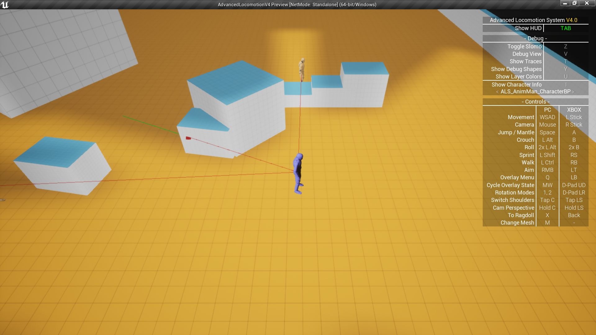

# UE4-Line-Of-Sight
Line of sight systems, with custom visbility checks, smooth rotation and movement, and customizable, made into a component, so its almost plug and play, the only thing needed its a Sight Trace channel.

It's fully comented, cleary divided and easy to understand.

The idea its to grab this system and customize it for your own game :D

== Sources ==

https://forums.unrealengine.com/development-discussion/blueprint-visual-scripting/104456-eqs-fog-of-war-field-of-vision-system?131826-EQS-Fog-of-war-Field-of-vision-system=

https://hippowombat.medium.com/tutorial-line-of-sight-visualizer-for-unreal-engine-f32113b1f6f3

== Package Used == 

https://www.unrealengine.com/marketplace/en-US/product/advanced-locomotion-system-v1?sessionInvalidated=true

